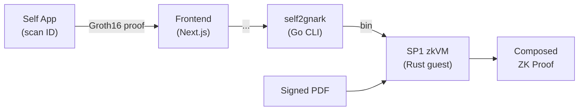

# Inkognito

Compose zkPDF document proofs with Self Protocol identity proofs (Passport, EU ID, Aadhaar) inside SP1 zkVM. Verifies a Groth16 identity proof, a PDF digital signature, and cross-checks the personal information, details between the two, all in a single zero-knowledge proof.



## End-to-End User Flow
- User provides a digitally signed PDF document (e.g., a signed contract, university transcript)
- User opens the Self Protocol mobile app and scans the QR code displayed in the browser. The app reads the NFC chip on their passport or ID card and generates a Groth16 proof of their identity attributes
- The Go converter transforms the proof from Self Protocol's format to gnark's native BN254 format, verifies the Groth16 pairing, decodes MRZ identity fields, and exports binary files
- The SP1 guest program loads the proof, verification key, public signals, and PDF bytes. Inside the zkVM, it verifies the Groth16 proof, validates the PDF's digital signature, extracts text, and cross-checks the identity fields against the PDF content
- The execution trace is submitted to Succinct's private prover network (optionally w/ local proof generation), producing a compressed STARK proof that attests to all five verification steps (which could be wrapped to PLONK or Groth16 for EVM verification)
-   Anyone with the proof and verifying key can confirm that a valid identity was cryptographically bound to a validly signed document, without seeing either

## Problem
There is currently no way to cryptographically bind a document to an identity without revealing both.
Consider a financial statement issued by a bank, a signed employment contract, or a government-issued certificate such as a university degree. Verifying that “this document belongs to this identity” today requires either:
(a) revealing the full document and the full identity to a verifier, or
(b) trusting an intermediary that has seen both.
Neither option preserves privacy. The document holder must choose between provability and confidentiality.

This problem is also explained very well in the blog post you shared under the Programmable Cryptography track, titled "Putting Cryptography Back Into Crypto"

## Solution
Inkognito lets you prove that a specific entity signed a specific document without revealing any identity information or the document’s contents.
It composes Self Protocol’s (self.xyz) zero-knowledge identity proofs , (supporting biometric e-passports, European national IDs, Aadhaar, and more) with zkPDF’s digital signature verification, all executed inside SP1’s zkVM.

The result is a single, succinct zero-knowledge proof that a particular entity such as an individual, government, or financial institution signed a specific document, while exposing no identifying information or document data to any third party.

Inkognito is permissionless in a way that you don’t need to ask your bank, employer, or government to generate a proof. As long as a document is digitally signed, you can generate the proof yourself.

It is also composable: digitally signed documents and identity proofs can be  combined in any way, reused, and recomposed for different verification contexts and purposes without re-exposing identity data or document contents.

Besides making identity checks more unfakeable, this solution also enables unique and more interesting use cases in the field of programmable cryptography and decentralized finance.
(Real World) Examples & Business Potentials

### Example 1 - Real Bank Statements
Enpara.com is a bank in Turkey that digitally signs all customer documents such as financial statements, gold purchase confirmations, and similar records which include the user’s name, surname, and ID number.
Once you obtain such a document, you can combine it with a zkID proof to prove that you are the rightful owner of the document. This is done by cross-checking the identity fields disclosed by the zkID proof against the fields embedded in the signed PDF, entirely inside the zkVM.
Using selective disclosure, you can then prove statements like:
“I own more than $1,000,000”
or “I own less than $1,000,000”
without revealing:
your exact balance
your full identity
or the full contents of the bank document

The same approach applies to any digitally signed document issued by the bank. These proofs can be reused in DeFi and other EVM-based applications in a fully programmable way, while preserving cryptographic integrity and privacy.

Similarly, NatWest,  a UK-focused bank, is also signing documents digitally.  

References: 
- https://trionlabs.dev/blog/zkpdf_enpara_case_study
- https://www.natwestgroup.com/news-and-insights/news-room/press-releases/data-and-technology/2024/jul/natwest-leads-in-bank-verified-digital-identity-by-integrating-o.html

### Example 2 - Poland Government Documents
The Polish government operates a national digital identity and signature system (Profil Zaufany) that allows holders of Polish ID credentials to digitally sign and verify PDF documents that are legally binding.
In addition to signing, the system also issues government documents that are digitally signed by default, making them natively verifiable.
With Inkognito, these government-signed documents can be combined with Polish passport or Polish national ID zero-knowledge proofs, enabling privacy-preserving use cases such as:
proving property ownership
proving participation in a legally signed contract
attesting to government-issued agreements
all without revealing the signer’s full identity or the document’s contents.
This enables official documents issued and signed through national government systems like this to be used in cryptographically verifiable, privacy-preserving workflows, including on-chain, cross-jurisdictional, and cross-border applications.

Reference: 
- https://www.gov.pl/web/gov/podpisz-dokument-elektronicznie-wykorzystaj-podpis-zaufany

There are many other real-world systems like these already in production that could be directly integrated :)


## Technical Details

**What SP1 verifies:**
1. Groth16 BN254 proof from Self Protocol (identity)
2. PDF digital signature (document authenticity)
3. Name, surname, ID number etc. cross-check between identity proof and PDF signer


### Prerequisites

- [Node.js](https://nodejs.org/) 18+ and pnpm
- [Go](https://go.dev/) 1.21+
- [SP1](https://docs.succinct.xyz/) v5.2.4: `sp1up --version v5.2.4`
- [ngrok](https://ngrok.com/) (Self Protocol requires a public endpoint)
- [Self Protocol](https://self.xyz/) app on your phone

### Step 1: Capture Identity Proof (Frontend)

```bash
cd app
pnpm install

# Start ngrok tunnel (separate terminal)
ngrok http 3000

# Set your ngrok URL in .env
cp .env.example .env

pnpm dev
```

1. Open `http://localhost:3000`
2. Scan the QR code with the Self Protocol app
3. Proof is saved to `proofs/` as JSON

### Step 2: Convert Proof (Go CLI)

```bash
cd self2gnark

# Convert + verify + decode identity + export gnark binaries
go run main.go --proof ../proofs/<proof_id>.json --export-gnark ../gnark-out/ --decode
```

This:
1. Converts Self Protocol format (`a/b/c`) to snarkjs (`pi_a/pi_b/pi_c`)
2. Auto-selects verification key by attestation type
3. Converts snarkjs to gnark via `circom2gnark` and verifies
4. Decodes MRZ identity fields (surname, given name, DOB, nationality)
5. Exports to `gnark-out/`: `proof.bin`, `vk.bin`, `public_inputs.bin`, `identity.json`

### Step 3: Verify in SP1

```bash
cd sp1

# Self Groth16 verification only
cargo run --release --bin prove -- --execute --gnark-dir ../gnark-out

# Groth16 + PDF signature + name, surname and ID number cross-check
cargo run --release --bin prove -- --execute --gnark-dir ../gnark-out --pdf <path-to-signed.pdf>
```

#### Flags

| Flag | Description |
|------|-------------|
| `--gnark-dir` | Directory with gnark exports (proof.bin, vk.bin, public_inputs.bin, identity.json) |
| `--pdf` | Optional signed PDF for signature verification + surname cross-check |
| `--execute` | Run in SP1 executor (fast, no proof generated) |
| `--prove` | Generate a full SP1 proof (slow on CPU) |

### Attestation Types

| ID | Type | Verification Key |
|----|------|-----------------|
| 1 | E-PASSPORT | `self-vkeys/vc_and_disclose.json` |
| 2 | EU_ID_CARD | `self-vkeys/vc_and_disclose_id.json` |
| 3 | AADHAAR | `self-vkeys/vc_and_disclose_aadhaar.json` |

### SP1 Verifier Patch

SP1 v5.2.4's `sp1-verifier` panics on zero-valued public inputs (`AffineG1 * Fr(0)` calls `unwrap()` on `None`). Our proof has zeros at indices 3-7, 13, 15. The patch applies a one-line fix:

```rust
// sp1-verifier-patch/src/groth16/verify.rs:45
if *i != Fr::zero() { acc + (*b * *i) } else { acc }
```

### Architecture
It is a four-stage pipeline:

*Step 1: Identity Proof Capture*
The user scans a QR code with the Self Protocol mobile app and generates a Groth16 BN254 proof for selectively disclosing identity attributes such as name, surname, ID number, date of birth, and more, using Self Protocol’s Circom / snarkJS circuits.

*Step 2: Proof Format Conversion*
The Circom / snarkJS proof is converted into gnark format so it can be verified inside the SP1 zkVM. This conversion is required because Self, snarkJS, and gnark use different binary encodings for the same cryptographic objects (proofs, verifying keys, and public inputs), even though they implement the same Groth16 protocol over BN254.
The conversion process:
- Normalizes proof and verifying key data across toolchains
- Adapts group element encodings (G1 and G2) to gnark’s expected format
- Reorders and re-encodes public inputs into gnark-compatible field representations
- Performs a full Groth16 pairing check as an early correctness and sanity check
- After successful conversion and verification, the data is exported in a compact binary format for use inside the SP1 program.
This step is to make sure that a proof generated can be safely, deterministically, and verifiably consumed by the zkVM without altering its cryptographic meaning.

*Step 3: SP1 Program*
Inside the SP1 program, what Inkognito does  is:
- Verify the Self zkID Groth16 proof using the BN254 precompile
- Unpack Groth16 public inputs to recover identity fields from public signals
- Verify PDF digital signatures (PKCS#7 / CMS + X.509)
- Extract structured fields from the PDF using regular expressions for selective disclosure
- Cross-check identity fields from the Groth16 proof against PDF content
    - ID number
    - Surname
    - Given name
    - Date of birth
This way it's for sure that the zkID data is matching with the zkPDF data. 

*Step 4: Proof Generation*
Proof generation can happen locally or via private prover networks (e.g. Succinct’s private prover network using TEEs).
The resulting proof can be used in peer-to-peer applications, or on-chain verification via wrapped PLONK or Groth16 proofs.

### Performance
Operation: Cycles (SP1 v5.2.4) 
Groth16 BN254 Verification: ~8,000,000 
PDF signature + text extraction + cross-check: ~21,800,000 
Total (identity + PDF): ~29,800,000

### Security Model
What is proven (inside zkVM)
The Groth16 proof is valid under the Self Protocol verification key
The PDF's digital signature is cryptographically valid (PKCS#7/CMS)
The identity fields extracted from the proof's public signals appear in the PDF

(composability)[composability.jpg]